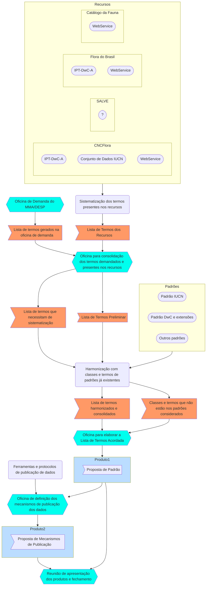

# Fluxograma

[Fluxo de trabalho](fluxograma.md)

```mermaid
flowchart TB
    %% Fluxo de trabalho da Consultoria
    %%Configs
    style 3 fill:#f96
    style 5 fill:#f96
    style 6 fill:#f96
    style 16 fill:#f96
    style 10 fill:#f96
    style 17 fill:#f96
    style 2 fill:#0fe
    style 4 fill:#0fe
    style 15 fill:#0fe
    style 12 fill:#0fe
    style 18 fill:#0fe
    style Produto1 fill:#bdf
    style Produto2 fill:#bdf 


    %% define os recursos existentes que precisam ter seus termos levantados e compilados
    subgraph Recursos
        direction RL    
        subgraph CNCFlora
            direction TB
            rec1([IPT-DwC-A])
            rec2([Conjunto de Dados IUCN])
            rec3([WebService])
        end
        subgraph SALVE
            direction TB
            rec4([?])
        end
        subgraph Flora do Brasil
            direction TB
            rec5([IPT-DwC-A])
            rec6([WebService])
        end
        subgraph Catálogo da Fauna
            direction TB
            rec8([WebService])
        end
     end
    
    %% a partir dos recursos, ação de compilar os termos dos recursos
    Recursos --> 19(Sistematização dos termos presentes nos recursos)

    %% os recursos existentes geram uma lista de termos - produto 3
    19 --> 3>Lista de Termos dos Recursos]
    
    %% a oficina 2 gera o produto produto 16 
    2{{Oficina de Demanda do MMA/DESP}} --> 16>Lista de termos gerados na oficina de demanda]

    %% os produto 3 e 16 alimentam a oficina de consolidação dos termos (4) com a lista dos termos provenientes dos recursos (3) e a lista de termos demandados na oficina do MMA/DESP (16)
    3 --> 4{{Oficina para consolidação dos termos demandados e presentes nos recursos}}
    16 --> 4

    %% a oficina de consolidação (4) tem como resultado uma lista de termos preliminar (6) e uma lista de termos que é demandada pelo MMA mas não está presente nos recursos (5)
    4 --> 5>Lista de termos que necessitam de sistematização]
    4 --> 6>Lista de Termos Preliminar]

    %% bloco dos padrões existentes (9)
    subgraph Padrões
        direction RL
        G([Padrão IUCN])
        H([Padrão DwC e extensões])
        I([Outros padrões])
    end
    

    %% os produtos da oficina de consolidação (4) - a saber: a lista de termos preliminar (6) e a lista de termos que precisam ser sistematizados (5) alimentam a ação de harmonização (7).
    6 --> 7(Harmonização com classes e termos de padrões já existentes)
    5 --> 7 
    Padrões --> 7

    %% a ação de harmonização gera uma lista de termos consolidados e acordados (17) e uma lista de termos que não existe nos padrões e precisam ser definidos em um novo padrão
    7 --> 17>Lista de termos harmonizados e consolidados]

    %% esta lista de termos harmonizados e consolidados (17), assim como a lista de classes e termos que não estão nos padrões existentes e precisam ser definidos, alimenta a oficina para a elaboração da lista de termos acordados, que irá, em última instância, gerar o Produto1 - a proposta de padrão

    17 --> 15{{Oficina para elaborar a Lista de Termos Acordada}}
    10 --> 15
    15  --> Produto1


    %% a ação de harmonização irá encontrar classes e termos demandados que não estão presentes em nenhum padrão, gerando a necessidade de sistematizar essas classes e termos em um relatório (10)
    7 --> 10>Classes e termos que não estão nos padrões considerados]

    %% o Produto1 é gerado pela compilação das classes e termos presentes nos padrões existentes e por um novo conjunto de classes e termos, não presentes nos padrões mas demandados pelo MMA
    subgraph Produto1
        11>Proposta de Padrão]
    end
    
    %% o Produto1 alimenta a oficina para definição dos mecanimos de publicação
    Produto1 --> 12{{Oficina de definição dos mecanismos de publicação dos dados}}

    %% ferramentas e protocolos de publicação de dados também alimenta a oficina 13
    13(Ferramentas e protocolos de publicação de dados) --> 12

    %% a oficina 13 gera a proposta de mecanismos de publicação
    subgraph Produto2
        14>Proposta de Mecanismos de Publicação]
    end
    12 --> Produto2
    Produto1 --> 18{{Reunião de apresentação dos produtos e fechamento}}
    Produto2 --> 18
```

