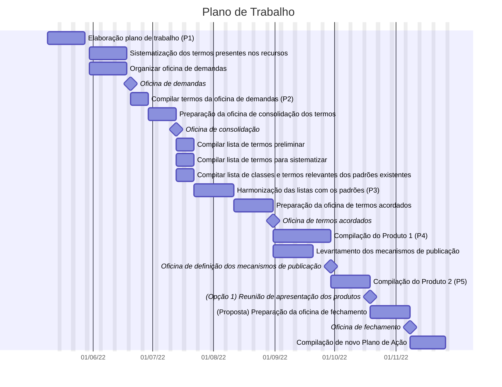

```mermaid
gantt
    dateFormat DD/MM/YY
    axisFormat  %d/%m/%y
    todayMarker on
    title Plano de Trabalho
    excludes weekends
    Elaboração plano de trabalho (P1): t0, 09/05/22, 15d
    Sistematização dos termos presentes nos recursos :t1, after t0, 15d
    Organizar oficina de demandas :t2, after t0, 15d
    Oficina de demandas :milestone,0d
    Compilar termos da oficina de demandas (P2) :t3, after t2, 1w
    Preparação da oficina de consolidação dos termos :t4, after t3, 10d
    Oficina de consolidação :milestone,0d
    Compilar lista de termos preliminar :t5, after t4, 1w
    Compilar lista de termos para sistematizar :t6, after t4, 1w
    Compitar lista de classes e termos relevantes dos padrões existentes :t7, after t4, 1w
    Harmonização das listas com os padrões (P3):t8, after t5 t6 t7, 2w
    Preparação da oficina de termos acordados :t9, after t8, 2w
    Oficina de termos acordados :milestone, 0d
    Compilação do Produto 1 (P4) :t10, after t9, 3w
    Levantamento dos mecanismos de publicação :t11, after t9, 2w
    Oficina de definição dos mecanismos de publicação :milestone, after t10 t11, 0d
    Compilação do Produto 2 (P5) :t13, after t10, 2w
    (Opção 1) Reunião de apresentação dos produtos :milestone, 0d
    (Proposta) Preparação da oficina de fechamento:t14, after t13, 2w
    Oficina de fechamento :milestone, 0d
    Compilação de novo Plano de Ação:t15, after t14, 2w
```