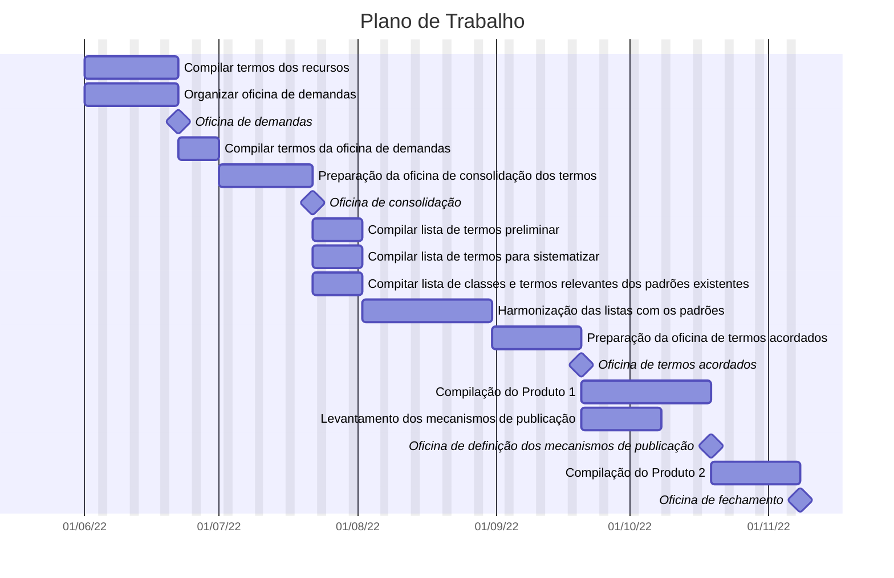

```mermaid
gantt
    dateFormat DD/MM/YY
    axisFormat  %d/%m/%y
    todayMarker on
    title Plano de Trabalho
    excludes weekends
    Compilar termos dos recursos :t1, 01/06/22, 15d
    Organizar oficina de demandas :t2, 01/06/22, 15d
    Oficina de demandas :milestone,0d
    Compilar termos da oficina de demandas :t3, after t2, 1w
    Preparação da oficina de consolidação dos termos :t4, after t3, 15d
    Oficina de consolidação :milestone,0d
    Compilar lista de termos preliminar :t5, after t4, 1w
    Compilar lista de termos para sistematizar :t6, after t4, 1w
    Compitar lista de classes e termos relevantes dos padrões existentes :t7, after t4, 1w
    Harmonização das listas com os padrões :t8, after t5 t6 t7, 3w
    Preparação da oficina de termos acordados :t9, after t8, 2w
    Oficina de termos acordados :milestone, 0d
    Compilação do Produto 1 :t10, after t9, 3w
    Levantamento dos mecanismos de publicação :t11, after t9, 2w
    Oficina de definição dos mecanismos de publicação :milestone, after t10 t11, 0d
    Compilação do Produto 2 :t13, after t10, 2w
    Oficina de fechamento :milestone, 0d
```