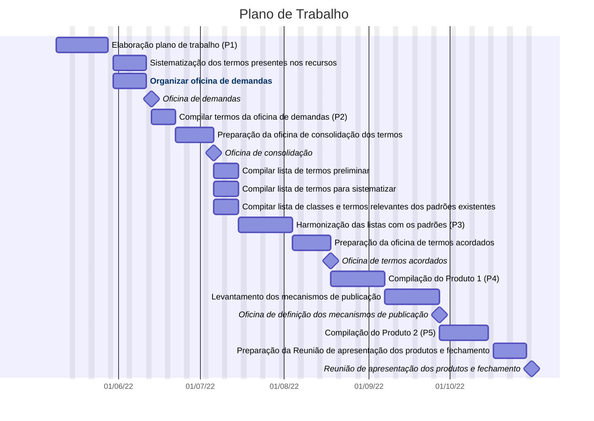

```mermaid
gantt
    dateFormat DD/MM/YY
    axisFormat  %d/%m/%y
    todayMarker on
    title Plano de Trabalho
    excludes weekends
    Elaboração plano de trabalho (P1): t0, 09/05/22, 15d
    Sistematização dos termos presentes nos recursos :t1, after t0, 10d
    Organizar oficina de demandas :t2, after t0, 10d
    Oficina de demandas :milestone,0d
    Compilar termos da oficina de demandas (P2) :t3, after t2, 1w
    Preparação da oficina de consolidação dos termos :t4, after t3, 10d
    Oficina de consolidação :milestone,0d
    Compilar lista de termos preliminar :t5, after t4, 1w
    Compilar lista de termos para sistematizar :t6, after t4, 1w
    Compitar lista de classes e termos relevantes dos padrões existentes :t7, after t4, 1w
    Harmonização das listas com os padrões (P3):t8, after t5 t6 t7, 2w
    Preparação da oficina de termos acordados :t9, after t8, 10d
    Oficina de termos acordados :milestone, 0d
    Compilação do Produto 1 (P4) :t10, after t9, 2w
    Levantamento dos mecanismos de publicação :t11, after t10, 2w
    Oficina de definição dos mecanismos de publicação :milestone, 0d
    Compilação do Produto 2 (P5) :t12, after t11, 2w
    Preparação da Reunião de apresentação dos produtos e fechamento :t13, after t12, 10d
    Reunião de apresentação dos produtos e fechamento :milestone, 0d
    
    click t2 href "https://github.com/edalcin/MMA-Ameacadas/blob/main/plano-de-trabalho/plano-de-trabalho.md#2-realiza%C3%A7%C3%A3o-da-oficina-de-demandas-do-mmadesp"
```
