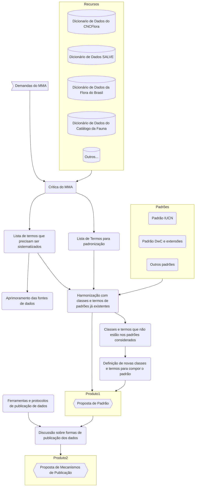

```mermaid
flowchart TB
    A(Critica do MMA) --> B(Lista de Termos para padronização)
    A --> C(Lista de termos que precisam ser sistematizados)
    D>Demandas do MMA] --> A
    Recursos --> A
    subgraph Recursos
        direction RL    
        dc1[(Dicionario de Dados do CNCFlora)]
        dc2[(Dicionário de Dados SALVE)]
        dc3[(Dicionário de Dados da Flora do Brasil)]
        dc4[(Dicionário de Dados do Catálogo da Fauna)]
        dc5[(Outros...)]
     end
    C(Lista de termos que precisam ser sistematizados) --> E(Aprimoramento das fontes de dados)
    C --> F(Harmonização com classes e termos de padrões já existentes)
    B --> F(Harmonização com classes e termos de padrões já existentes)
        subgraph Padrões
        direction RL
        G(Padrão IUCN)
        H(Padrão DwC e extensões)
        I(Outros padrões)
    end
    Padrões --> F   
    F --> J(Classes e termos que não estão nos padrões considerados)
    J --> K(Definição de novas classes e termos para compor o padrão)
    subgraph Produto1
        L{{Proposta de Padrão}}
    end
    F --> Produto1
    K --> Produto1
    Produto1 --> M(Discussão sobre formas de publicação dos dados)
    subgraph Produto2
        N{{Proposta de Mecanismos de Publicação}}
    end
    O(Ferramentas e protocolos de publicação de dados) --> M
    M --> Produto2
```
