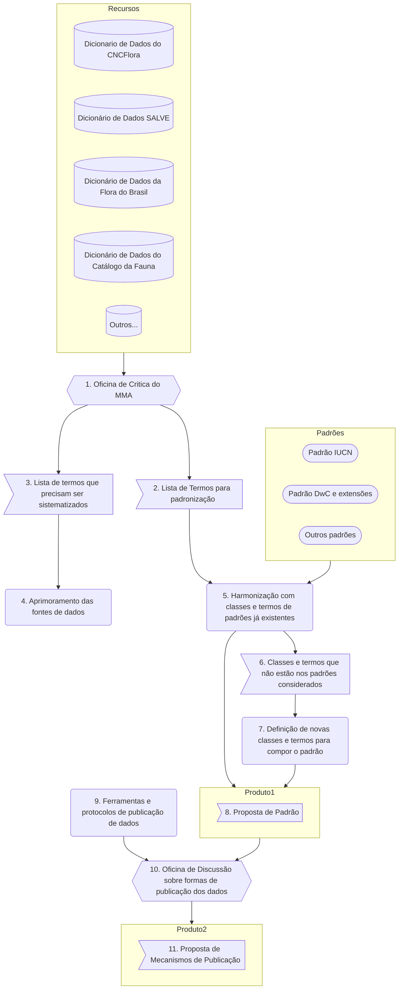

# Fluxograma

### Fluxo de Trabalho

```mermaid
flowchart TB
    A{{1. Oficina de Critica do MMA}} --> B>2. Lista de Termos para padronização]
    A --> C>3. Lista de termos que precisam ser sistematizados]
    Recursos --> A
    subgraph Recursos
        direction RL    
        dc1[(Dicionario de Dados do CNCFlora)]
        dc2[(Dicionário de Dados SALVE)]
        dc3[(Dicionário de Dados da Flora do Brasil)]
        dc4[(Dicionário de Dados do Catálogo da Fauna)]
        dc5[(Outros...)]
     end
    C --> E(4. Aprimoramento das fontes de dados)
    B --> F(5. Harmonização com classes e termos de padrões já existentes)
        subgraph Padrões
        direction RL
        G([Padrão IUCN])
        H([Padrão DwC e extensões])
        I([Outros padrões])
    end
    Padrões --> F   
    F --> J>6. Classes e termos que não estão nos padrões considerados]
    J --> K(7. Definição de novas classes e termos para compor o padrão)
    subgraph Produto1
        L>8. Proposta de Padrão]
    end
    F --> Produto1
    K --> Produto1
    Produto1 --> M{{10. Oficina de Discussão sobre formas de publicação dos dados}}
    subgraph Produto2
        N>11. Proposta de Mecanismos de Publicação]
    end
    O(9. Ferramentas e protocolos de publicação de dados) --> M
    M --> Produto2
```

#### Legenda

```mermaid
flowchart TB

X{{Oficina}}
Y>Documento ou Relatório]
Z(Ação)
```
