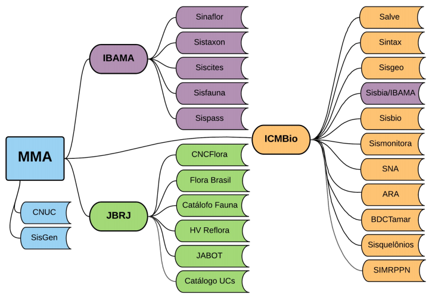

# 1.Recursos

Consideramos "Recursos" os Sistemas de Informação dobre Biodiversidade e vinculadas, citados no relatório "**A Gestão de Dados e Informação sobre Biodiversidade no Ministério do Meio Ambiente e Instituições Vinculadas**", por João Lanna, em 2021:

Serão selecionados e sistematizados os termos e classes dos dicionários de dados dos sistemas.
