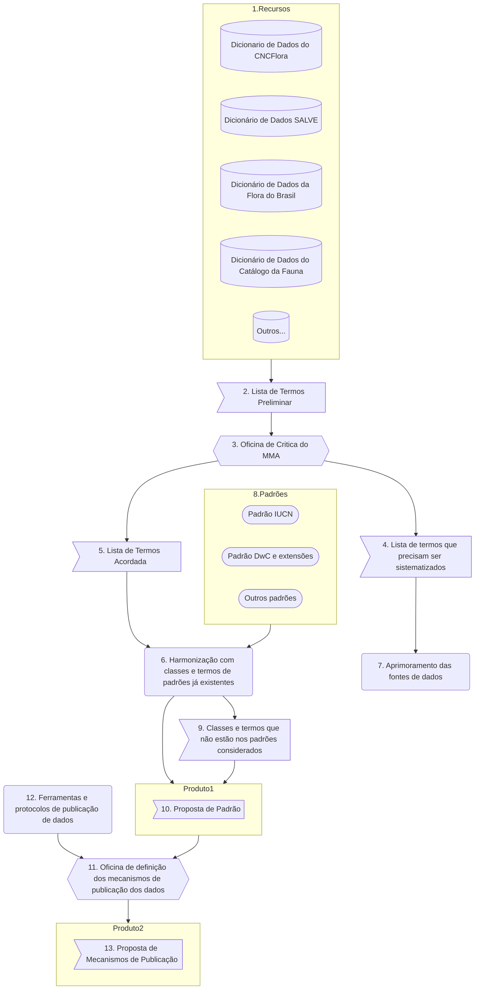
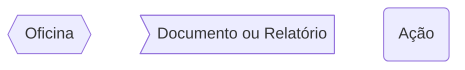

# Fluxograma

[Fluxo de trabalho](./)

```mermaid
flowchart TB
    
    %% define os recursos existentes que precisam ter seus termos levantados e compilados
    subgraph 1.Recursos
        direction RL    
        dc1[(Dicionario de Dados do CNCFlora)]
        dc2[(Dicionário de Dados SALVE)]
        dc3[(Dicionário de Dados da Flora do Brasil)]
        dc4[(Dicionário de Dados do Catálogo da Fauna)]
        dc5[(Outros...)]
     end
    
    %% geração do produto (2) 
    1.Recursos --> 2>2. Lista de Termos Preliminar]

    %% produto (2) alimenta a oficina do MMA para critica aos termos existentes (3)
    2 --> 3{{3. Oficina de Critica do MMA}}

    %% a oficina (3) tem como resultado uma lista de termos acordada (5) e uma lista de termos que é demandada pelo MMA mas não está presente nos recursos (4)
    3 --> 4>4. Lista de termos que precisam ser sistematizados]
    3 --> 5>5. Lista de Termos Acordada]

    %% a lista de termos que é demandada mas não está presente nos recursos alimenta um o aprimoramento das fontes de dados (7)
    4 --> 7(7. Aprimoramento das fontes de dados)
    
    %% a lista de termos acordada na oficina (5) alimenta a ação de harmonização dos termos com os padrões existentes (8), na ação (6)
    5 --> 6(6. Harmonização com classes e termos de padrões já existentes)

    %% bloco dos padrões existentes (8)
    subgraph 8.Padrões
        direction RL
        G([Padrão IUCN])
        H([Padrão DwC e extensões])
        I([Outros padrões])
    end
    8.Padrões --> 6

    %% a ação de harmonização irá encontrar classes e termos demandados que não estão presentes em nenhum padrão, gerando a necessidade de sistematizar essas classes e termos em um relatório (9)
    6 --> 9>9. Classes e termos que não estão nos padrões considerados]

    %% o Produto1 é gerado pela compilação das classes e termos presentes nos padrões existentes e por um novo conjunto de classes e termos, não presentes nos padrões mas demandados pelo MMA
    subgraph Produto1
        10>10. Proposta de Padrão]
    end
    6 --> Produto1
    9 --> Produto1

    %% o Produto1 alimenta a oficina para definição dos mecanimos de publicação
    Produto1 --> 11{{11. Oficina de definição dos mecanismos de publicação dos dados}}

    %% ferramentas e protocolos de publicação de dados também alimenta a oficina 11
    12(12. Ferramentas e protocolos de publicação de dados) --> 11

    %% a oficina 12 gera a proposta de mecanismos de publicação
    subgraph Produto2
        13>13. Proposta de Mecanismos de Publicação]
    end
    11 --> Produto2
```

#### Legenda

```mermaid
flowchart TB

X{{Oficina}}
Y>Documento ou Relatório]
Z(Ação)
```
